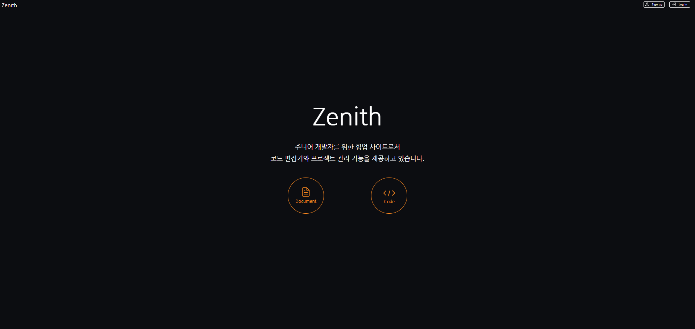
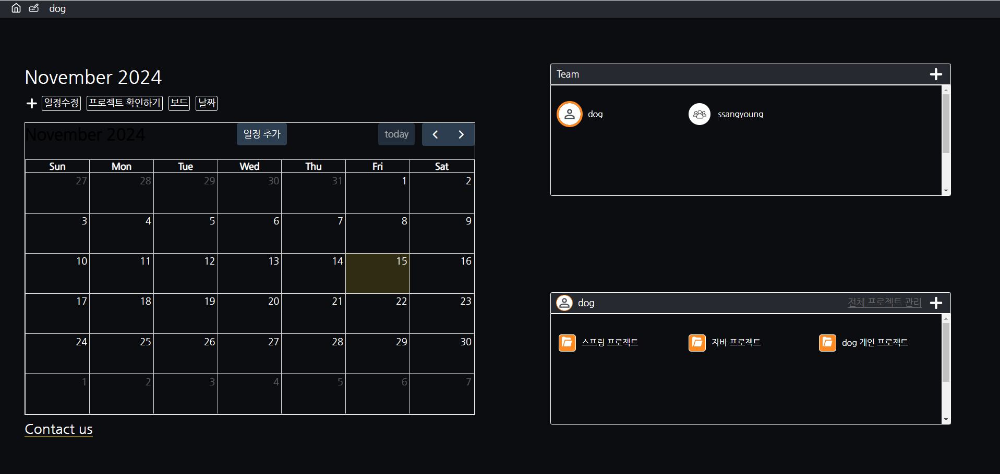
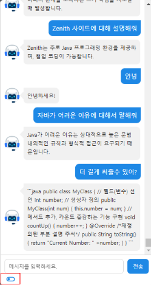
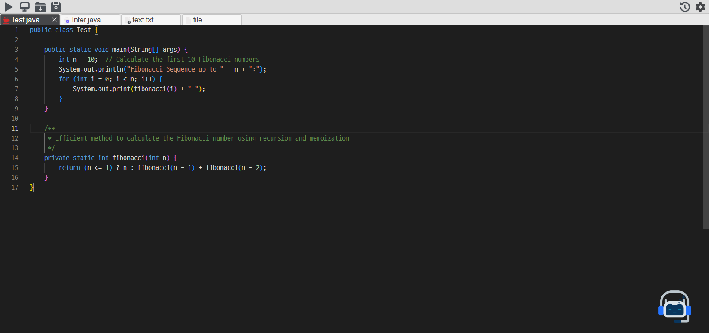
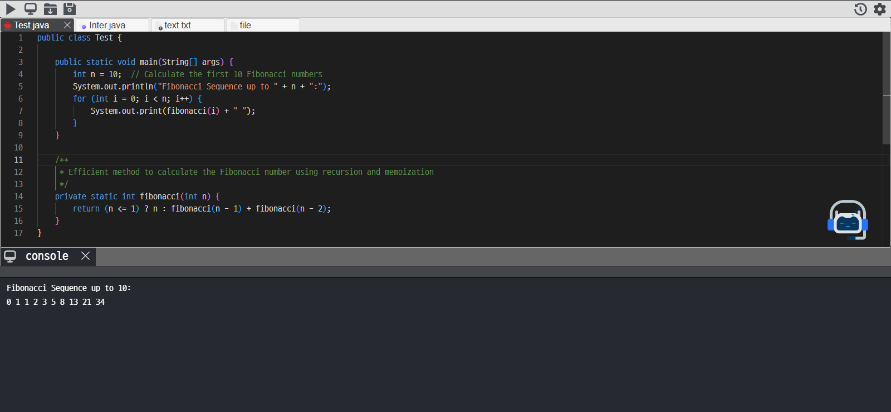
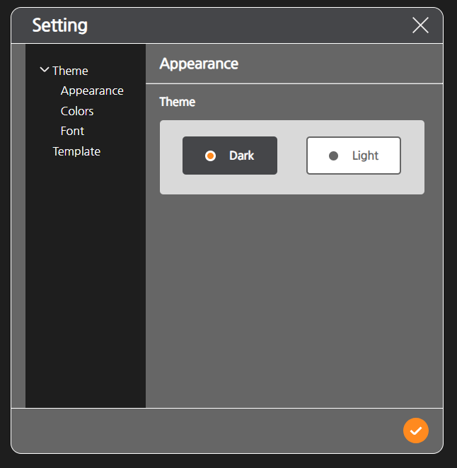

# 🌟 Zenith

## 📌 프로젝트 개요

**Zenith**는 Spring 기반의 **실시간 코드 편집기 웹 애플리케이션**으로, 주니어 개발자들이 개발 환경을 설정하지 않아도 **실시간 협업이 가능**하도록 설계되었습니다.

## 🎯 기획 의도 및 목표

-   개발 환경 설정 없이 **협업 코드 편집** 가능
-   **실시간 코드 수정 및 실행** 지원
-   **AI 챗봇 및 대화 통계 분석** 기능 제공
-   **채팅 및 음성 채팅** 기능 포함

## 📅 프로젝트 기간

-   **2024.10.22 \~ 2024.11.11**

## 👨‍💻 개발 인원

-   **6명**

## 🛠 개발 환경

-   **운영체제**: Windows 11, Linux(Ubuntu)
-   **서버**: Apache Tomcat, AWS EC2, Oracle
-   **개발 툴**: STS 3, Visual Studio Code, SQL Developer
-   **협업 툴**: GitHub, Notion, Discord, ERD Cloud, Draw\.io, Figma, Google Drive, MiriCanvas

## 💻 사용 기술

-   **프로그래밍 언어**: Java 11, HTML, CSS, JavaScript (ES6), ANSI-SQL, PL/SQL
-   **프레임워크 및 라이브러리**:
    -   Spring, Maven, Spring Security, Lombok, HikariCP, MyBatis, Tiles, Jackson
    -   jQuery, jQuery UI, Ajax, RESTful API
    -   Monaco Editor, OpenAI API, FullCalendar Library
-   **데이터베이스**: Oracle 11g EX

## 🚀 주요 기능

✅ **코드 편집 및 실시간 협업**

-   다수의 사용자가 동시에 코드 편집 가능
-   WebSocket을 활용한 실시간 동기화
-   CRDT를 활용한 충돌 방지

✅ **코드 컴파일 및 실행 결과 제공**

-   코드 실행 결과를 실시간으로 확인 가능
-   에러 감지 및 코드 분석 지원

✅ **AI 챗봇 및 대화 통계 분석**

-   OpenAI API를 활용한 AI 코드 도우미
-   사용자의 코드 작성 패턴 분석 및 피드백 제공

✅ **채팅 기능 지원**

-   텍스트 채팅 및 음성 채팅 지원

## 📌 구현 화면

<table>
  <tr>
    <th>메인 페이지</th>
    <th>마이 페이지</th>
    <th>챗봇</th>
  </tr>
  <tr>
    <td></td>
    <td></td>
    <td></td>
  </tr>
  <tr>
    <th>에디터</th>
    <th>코드 실행</th>
    <th>에디터 설정</th>
  </tr>
  <tr>
    <td></td>
    <td></td>
    <td></td>
  </tr>
</table>
# code-editor
